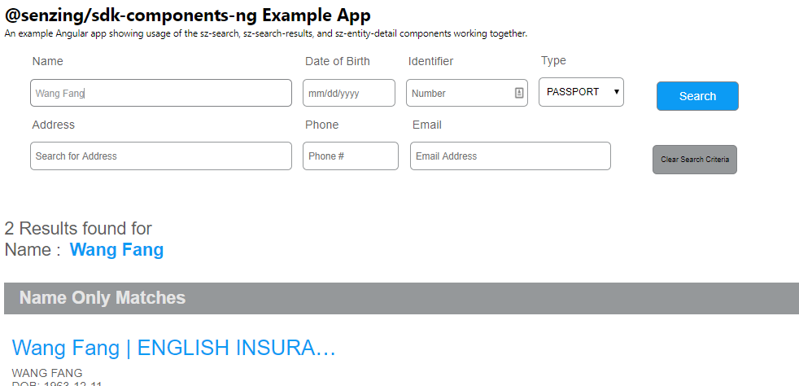
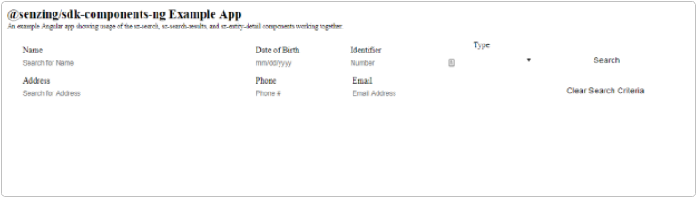

# Example Angular App using @senzing/sdk-components-ng


## Overview
This is an example web app using angular and components from the @senzing/sdk-components-ng package. It is meant to serve as a living document illustrating the steps necessary to get up and running with the web components connecting to a G2 project datasource through the [Senzing API Server](https://github.com/Senzing/senzing-api-server).

You can check out this repo, do an `npm install`, then skip ahead to the 
[Start up Server(s) section](#Start-up-Servers). Or you can follow along with the steps below to create your own, and if you run in to any problems you can refer back to this code.

<div style="text-align: center; margin: 10px 0 30px">
  
</div>

### Steps:
  - [Prerequisites](#install-nodejs--angular-cli)
  - [Create a new App](#create-a-new-app)
  - [Add SDKModule (app.module.ts)](#add-sdkmodule-appmodulets)
  - [Add sdk component tags (app.component.html)](#add-sdk-component-tags-appcomponenthtml)
  - [Update controller logic (app.component.ts)](#update-controller-logic-appcomponentts)
  - [API Server](#api-server)
  - [APP Server](#app-server)
  - [Add a Theme (styles.scss)](#add-a-theme-stylesscss)

<br/>

## Install NodeJS & Angular CLI
If you haven't already done so, install NodeJS and the Angular CLI. The compatible node versions as of the time of writing this are 8.x or 10.x.

#### Existing
You should check [here](https://angular.io/guide/quickstart#prerequisites) to see that those are still the supported versions. If you've already installed node, great! lets just check the version `node -v` and check that we're good to go:


If not, either update node [via the cmdline](https://www.youtube.com/watch?v=C9gehlXhS6U) or just go through the steps as if you were installing it from scratch below.

#### Download
Go grab the binary for the apropriate platform from https://nodejs.org/ and come back here once done.

<a hfre="https://nodejs.org/"></a>


Now that you've installed Node a whole magical world of packages and tools have opened up. .. 
Lets install the angular cli tool using some of that new power. 
```
npm install -g @angular/cli@1.7.1
```

#### What is Node?
If you've never used node, angular, or typescript before you should check out some of the many arcticles or videos on the subject.
* [Learn Node in 1 Hour | Mosh](https://www.youtube.com/watch?v=TlB_eWDSMt4)
* [Learn Angular 7 in 50 Minutes](https://www.youtube.com/watch?v=5wtnKulcquA)
* [Learn Angular from Scratch | Mosh](https://www.youtube.com/watch?v=k5E2AVpwsko)

You should be able to follow along with no familiarity as well, but you might _not_ *know* the _*why*_ of why we're doing some things the way we are.


#### Lets get things rolling..
<br>


## Create a new App

You don't have to do it this way, these are just the steps I used to create a brand new angular app and add the @senzing/sdk-components-ng module to it. 

```
ng new sdk-components-example-angular-app --minimal=true --skipGit=true --skipTests=true --style=scss

cd sdk-components-example-angular-app
```

Install the sdk components:
```
npm install @senzing/sdk-components-ng --save
```
<br/><br/>

## Add SDKModule (app.module.ts)
In [app.module.ts](https://github.com/Senzing/sdk-components-example-angular-app/blob/initial-commit/src/app/app.module.ts) add the following import:
```typescript
import { SenzingSdkModule, SzRestConfiguration  } from '@senzing/sdk-components-ng';
```

then add a factory method that can handle non-default configuration:
```typescript
// create exportable factory  
// for AOT compilation
export function SzRestConfigurationFactory() {
  return new SzRestConfiguration({
    basePath: 'http://localhost:2080',
    withCredentials: true
  });
}
```

then pass the configuration factory to the applications annotations imports array:
```typescript
imports: [
    BrowserModule,
    SenzingSdkModule.forRoot( SzRestConfigurationFactory )
  ],
```

the full [app.module.ts](https://github.com/Senzing/sdk-components-example-angular-app/blob/initial-commit/src/app/app.module.ts) code should look something  like the following:
```typescript
import { BrowserModule } from '@angular/platform-browser';
import { NgModule } from '@angular/core';
import { HttpClientModule, HttpClient } from '@angular/common/http';
import { SenzingSdkModule, SzRestConfiguration  } from '@senzing/sdk-components-ng';

import { AppComponent } from './app.component';

// create exportable factory  
// for AOT compilation
export function SzRestConfigurationFactory() {
  return new SzRestConfiguration({
    basePath: 'http://localhost:2080',
    withCredentials: true
  });
}

@NgModule({
  declarations: [
    AppComponent
  ],
  imports: [
    BrowserModule,
    SenzingSdkModule.forRoot( SzRestConfigurationFactory )
  ],
  providers: [],
  bootstrap: [AppComponent]
})
export class AppModule { }
```
<br/><br/>

### Add sdk component tags (app.component.html)

We're going to use three components from the [Senzing SDK Components](https://github.com/Senzing/sdk-components-ng) package.


1. [SzSearchComponent](https://senzing.github.io/sdk-components-ng/components/SzSearchComponent.html): The search input interface
2. [SzSearchResultsComponent](https://senzing.github.io/sdk-components-ng/components/SzSearchResultsComponent.html): A list of matching and related entities
3. [SzEntityDetailComponent](https://senzing.github.io/sdk-components-ng/components/SzEntityDetailComponent.html): A clickable view with additional details


The full [app.component.html](https://github.com/Senzing/sdk-components-example-angular-app/blob/initial-commit/src/app/app.component.html) code should look something like the following:

```html
<div style="text-align:left; font-weight: bold; font-size: 1.5em">
    @senzing/sdk-components-ng/examples/search-with-results-and-details
</div>

<div style="text-align:left; text-decoration: italic; font-size: 0.8em; margin: 2px 0 10px 0;">
    An example Angular app showing usage of the sz-search, sz-search-results,
    and sz-entity-detail components working together.
</div>
  
<!-- start search box -->
<div class="component-example">
    <sz-search
        (resultsChange)="onSearchResults($event)"
        (resultsCleared)="onSearchResultsCleared($event)"
        (parameterChange)="onSearchParameterChange($event)"></sz-search>
</div>
<!-- end search box -->

<!-- start search results -->
<div class="component-example">
    <sz-search-results *ngIf="showSearchResults" [results]="currentSearchResults" [parameters]="currentSearchParameters" (resultClick)="onSearchResultClick($event)"></sz-search-results>
</div>
<!-- end search results -->
<!-- start entity detail -->
<div *ngIf="showSearchResultDetail">
    <div class="detail-wrapper">
        <button (click)="onBackToSearchResultsClick($event)">&lt;&lt; Go Back to Search Results</button>
    </div>
    <sz-entity-detail [entityId]="currentlySelectedEntityId"></sz-entity-detail>
</div>
<!-- end entity detail -->
```
<br/>
At this point your IDE will be showing lots of red underlines. Don't panic, that's totally normal. We're going to add the missing bits in the next step.
<br/><br/><br/>

### Update controller logic ([app.component.ts](https://github.com/Senzing/sdk-components-example-angular-app/blob/initial-commit/src/app/app.component.ts))
First add the interface types from the SDK we'll be using. We'll want those so that the static analysis can catch any fumbles on our part. Open up [app.component.ts](https://github.com/Senzing/sdk-components-example-angular-app/blob/initial-commit/src/app/app.component.ts) and add the folowing to the top of the file:

```typescript
import { Component } from '@angular/core';
import {
  SzEntitySearchParams,
  SzAttributeSearchResult
} from '@senzing/sdk-components-ng';
```


Now lets add those event handlers and variables that we referenced in the [app.component.html](https://github.com/Senzing/sdk-components-example-angular-app/blob/initial-commit/src/app/app.component.html) file above.
They are:
* onSearchResults (when a search is performed we want to know the results)
* onSearchResultsCleared (to handle when the search form is cleared)
* onSearchParameterChange (to handle when parameters for the search are changed)
* onSearchResultClick (to handle when a entity item in the search results list is clicked on)
* onBackToSearchResultsClick (when on the entity detail page, and the user wants to go back to the search results list)


We'll also need a few variables, mostly for state tracking but also to pipe outputs from some of the components in to others.
* currentSearchResults (to hold the event output of the onSearchResults handler)
* currentSearchParameters (to hold the current parameters that search was performed with)
* currentlySelectedEntityId (to hold the entityId of a item that was clicked on from onSearchResultClick)

<br/><br/>

The full [app.component.ts](https://github.com/Senzing/sdk-components-example-angular-app/blob/initial-commit/src/app/app.component.ts) code should look something like the following:

```typescript
import { Component } from '@angular/core';
import {
  SzEntitySearchParams,
  SzAttributeSearchResult
} from '@senzing/sdk-components-ng';

@Component({
  selector: 'app-root',
  templateUrl: './app.component.html',
  styleUrls: ['./app.component.scss']
})
export class AppComponent {
  public currentSearchResults: SzAttributeSearchResult[];
  public currentlySelectedEntityId: number = undefined;
  public currentSearchParameters: SzEntitySearchParams;

  public showSearchResults = false;
  public get showSearchResultDetail(): boolean {
    if(this.currentlySelectedEntityId && this.currentlySelectedEntityId > 0) {
      return true;
    }
    return false;
  }

  onSearchResults(evt: SzAttributeSearchResult[]){
    console.log('searchResults: ',evt);
    // store on current scope
    this.currentSearchResults = evt;
    // results module is bound to this property

    // show results
    this.showSearchResults = true;
  }

  public onBackToSearchResultsClick($event): void {
    this.showSearchResults = true;
    this.currentlySelectedEntityId = undefined;
  }

  public onSearchResultClick(entityData: SzAttributeSearchResult){
    console.log('onSearchResultClick: ', entityData);
    //alert('clicked on search result!'+ entityData.entityId);

    if(entityData && entityData.entityId > 0) {
      this.currentlySelectedEntityId = entityData.entityId;
      this.showSearchResults = false;
    } else {
      this.currentlySelectedEntityId = undefined;
      this.showSearchResults = true;
    }
  }

  public onSearchResultsCleared(searchParams: SzEntitySearchParams){
    // hide search results
    this.showSearchResults = false;
    this.currentSearchResults = undefined;
    this.currentlySelectedEntityId = undefined;
  }

  public onSearchParameterChange(searchParams: SzEntitySearchParams) {
    console.log('onSearchParameterChange: ', searchParams);
    this.currentSearchParameters = searchParams;
  }
}

```
### Start up Servers
Start up the [Senzing API Server](https://github.com/Senzing/senzing-api-server). If you don't already have an instance of the rest server accessible to you over the network or on your local machine one you will have to set one up. 

For this example I've got the api server started using the default hostname and port(http://localhost:2208) and using the same G2.ini that my [Senzing Desktop App](https://senzing.com/senzing-app) install is using. (see default locations below)
<table>
    <thead>
        <tr><td>platform</td><td>default</td></tr>
    </thead>
    <tbody>
        <tr><td>Windows</td><td>%LOCALAPPDATA%\Senzing\Workbench\project_1\g2.ini</td></tr>
        <tr><td>Mac</td><td>~/Library/Application Support/com.senzing.workbench/workbench/project_1/g2.ini
</td></tr>
        <tr><td>Linux</td><td>/opt/senzing/g2/python/G2Module.ini</td></tr>
        <tr><td>Docker</td><td>[ TODO ]</td></tr>
    </tbody>
</table>

Those are just the default locations, depending on how the install was set up to operate it could be anywhere the administrator specified it to be. _When in doubt, ask about_

For more in depth information on G2Config Options and setup see [Senzing API [for Developers]
](https://senzing.zendesk.com/hc/en-us/categories/360000120514-Senzing-API-for-Developers-) or http://docs.senzing.com/1.4/#g2config 

#### API Server

```terminal
java -jar "%HOMEPATH%\www\rest-api-server-java\target\sz-api-server-1.5.0.jar" -iniFile "%LOCALAPPDATA%\Senzing\Workbench\project_1\g2.ini"
```

the result should be something like:


#### APP Server

Start up the angular dev server by opening a terminal up to our web app's root directory and type `npm start`

It should serve up the web server on port 4200 by default


Open up a web browser to the address/port noted in the screen shot below. By default this will be http://localhost:4200/




### Add a Theme (styles.scss)
By default components will come unstyled. It's much easier to *add* styles than it is to remove them(ask any web dev). So in general component styles are *opt-in* rather than *opt-out*.

Still though, it's pretty ugly huh? Included are a few [pre-built theme files](https://senzing.github.io/sdk-components-ng/additional-documentation/themes/pre-built.html), which is just the thing to add to get things a bit more presentable. Lets add one to the styles.scss file in the application:

```scss
@import '@senzing/sdk-components-ng/styles/themes/senzing.css';
```
<br/><br/>
After refresh:


That feels better right? ;-)
<br/><br/>

### Dockerizing

For extra credit you can dockerize this example. The easiest way is to use [docker 
compose](https://docs.docker.com/compose/) to build and start the image.

```
docker-compose up -d --build
```

That will build a image based off of NodeJS 10.15.1, and start up the container. By default the Examples Webapp will be deployed on http://localhost:4200/ with the default api configuration pointing at http://localhost:8080

If everything worked, you should now be able to open a web browser up and it should look exactly the same as running the `npm start` command.

To shut the container back down just type:
```
docker-compose stop
```


#### Configuration

The docker build uses a different angular environment file. If you are running the API Server on a different address than http://localhots:8080, you will want to set the appropriate values in that file. The file is located in [src/environments/environment.docker.ts](https://github.com/Senzing/sdk-components-example-angular-app/blob/initial-commit/src/environments/environment.docker.ts)

The values for the apiConfig constant is exactly the same as the [@senzing/rest-api-client-ng#ConfigurationParameters](https://senzing.github.io/rest-api-client-ng/interfaces/ConfigurationParameters.html)interface. 

